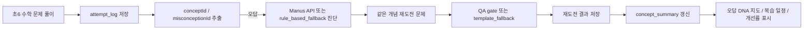

# ConceptMaster CodeFair Submission Package

## 현재 준비 증거

- 제품 메시지: 초6 수학 오답 DNA 지도.
- 한 줄 설명: 정답만 알려주는 앱이 아니라, 내가 왜 자꾸 틀리는지 찾아주고 다시 맞혔는지 확인하는 AI 오답 코치.
- Test baseline: `npm test` now reports 44 PASS.
- M3 browser proof: `QA_EVIDENCE/m3_retry_success_browser_check_20260608.json` shows wrong answer -> diagnosis -> same-concept retry -> correct retry -> data tab evidence, with improvement moving to 50%.
- DTT evidence: `src/dttTrace.js` renders Definition -> Test -> Trace on the research screen.
- Readiness audit: `src/readinessAudit.js` separates Auto-Verified evidence from the still-pending Human-Verified student trial.
- M5 data evidence: `src/misconceptionMap.js` builds `concept_master_m5_learning_evidence.v1` with `attempt_log`, `concept_summary`, and `demo_seed` / `judge_demo` / `human_trial` source separation.
- 30-second demo safety: `src/demoContract.js` requires the wrong -> diagnosis -> generation -> retry -> improvement loop to finish under 30 seconds without Manus API.
- Human trial gate: `GEONHO_HUMAN_TRIAL_CHECKLIST.md` must be filled before claiming Human-Verified.

## 작품요약서 문장

ConceptMaster는 초6 학생이 분수 통분, 비율 같은 수학 개념에서 같은 실수를 반복하는 문제를 해결하기 위한 AI 오답 코치 웹앱이다. 학생이 문제를 풀면 앱은 `attempt_log`에 문제 ID, 개념 ID, 오개념 ID, 정답 여부, 다음 복습일, AI 출처를 저장한다. 오답이 생기면 Manus API 또는 규칙 기반 fallback이 원인과 근거를 진단하고, 같은 개념 재도전 문제를 제안한다. 재도전 후에는 `concept_summary`에서 오답률, 대표 오개념, 회복 여부, 복습 일정을 보여주어 AI 개입이 실제 이해 회복으로 이어졌는지 데이터로 확인한다.

## DTT Score Trace

ConceptMaster는 DTT를 반복 테스트용 구호로 쓰지 않고, Definition -> Test -> Trace 방식으로 심사 주장을 고정한다. `dttTrace`는 오답 데이터, AI 진단, 같은 개념 재도전, QA gate, mastery/review, 30초 데모와 2분 발표를 각각 테스트와 코드 경로에 연결한다.

## 기술 구조도

핵심 데이터:

- `attempt_log`: `eventId`, `questionId`, `conceptId`, `misconceptionId`, `dataSource`, `isCorrect`, `retryCleared`, `nextReviewAt`, `aiSource`
- `concept_summary`: `conceptId`, `conceptKo`, `attempts`, `wrongAttempts`, `wrongRate`, `dominantMisconceptionId`, `retryCleared`, `nextReviewAt`, `dataSources`, `aiSources`
- `dataSource`: `demo_seed`는 시작 예시, `judge_demo`는 심사 데모, `human_trial`은 학생 직접 풀이
- `aiSource`: `manus_api`, `rule_based_fallback`, `template_fallback`, `manual`을 구분
- `mastery score`: 재도전 성공과 오답 누적을 반영해 개념 이해 회복 정도를 보여주는 점수
- `dttTrace`: Definition -> Test -> Trace로 기능 주장과 테스트, 코드, 증거 파일을 연결
- `readinessAudit`: Auto-Verified와 Human-Verified를 분리

## 기존 방식과 차이

- 기존 퀴즈앱은 정답과 해설을 보여주는 데서 끝난다.
- ConceptMaster는 오답을 개념과 오개념 데이터로 저장한다.
- AI 또는 규칙 진단은 “왜 틀렸는지”를 말하고, 같은 개념 문제로 다시 확인한다.
- 생성 문항은 바로 믿지 않고 QA gate와 fallback을 둔다.
- 데이터 탭에서 `attempt_log`와 `concept_summary`를 보여주므로 AI와 데이터 활용이 화면 증거로 남는다.

## 30초 시연 흐름

1. `30초 데모`를 누른다.
2. 앱이 일부러 오답을 기록하고 `judge_demo` 로그를 만든다.
3. 30초 데모는 크레딧 절약 모드로 실행되어 Manus 호출 없이 fallback 진단을 보여준다.
4. 같은 개념 재도전 문제를 만들거나 추천한다.
5. 재도전 성공을 저장하고 이전 오답을 `회복`으로 바꾼 뒤, 오답 DNA 지도, 개선률 50%, `attempt_log`, `concept_summary`를 데이터 탭에서 보여준다.

## 2분 영상 대본

1. 0-20초: “초6 학생은 분수 통분이나 비율에서 같은 개념 실수를 반복합니다. ConceptMaster는 이것을 오답 DNA로 기록하는 앱입니다.”
2. 20-40초: “문제를 풀면 답만 저장하지 않고 `attempt_log`에 개념, 오개념, 정답 여부, 다음 복습일, AI 출처를 저장합니다.”
3. 40-60초: “오답이면 AI 진단 구조로 원인과 근거를 보여줍니다. 발표 연습 때는 크레딧 절약 모드로 fallback을 쓰고, 필요하면 `AI 1회 사용`으로 live Manus 진단도 한 번만 확인할 수 있습니다.”
4. 60-80초: “앱은 같은 개념 재도전 문제를 추천합니다. 목표는 새 문제를 많이 내는 것이 아니라 같은 개념을 다시 맞혔는지 확인하는 것입니다.”
5. 80-100초: “재도전 후 `concept_summary`에서 오답률, 대표 오개념, 회복 여부, 복습 일정을 보여줍니다. 최신 M3 검증에서는 재도전 성공 후 이전 오답이 회복으로 바뀌고 개선률이 50%로 표시되었습니다.”
6. 100-120초: “그래서 이 앱은 AI 퀴즈앱이 아니라, 데이터로 내가 왜 틀리는지 찾고 다시 이해했는지 확인하는 AI 오답 코치입니다.”

## 대표문항

발표용 대표문항은 초6 수학 6개로 고정한다.

- `math_frac_001`
- `math_frac_002`
- `math_frac_003`
- `math_frac_004`
- `math_ratio_001`
- `math_ratio_002`

## 심사 Q&A

Q1. AI를 어디에 사용했나요?

A1. 오답 원인 진단과 같은 개념 재도전 문제 생성에 사용했다. 단, Manus API가 실패해도 규칙 기반 fallback과 template fallback으로 같은 학습 흐름이 유지된다.

Q2. 데이터는 어디에 있나요?

A2. 데이터 탭에 `attempt_log`와 `concept_summary`가 보인다. `demo_seed`, `judge_demo`, `human_trial`도 분리해서 실제 예시, 심사 데모, 학생 직접 풀이를 구분한다.

Q3. 왜 대상권 아이디어라고 볼 수 있나요?

A3. 단순히 문제를 많이 내는 앱이 아니라 반복 오답이라는 실제 학습 문제를 데이터화하고, AI 진단, 같은 개념 재도전, 복습 일정, 개선률까지 하나의 증거 루프로 보여주기 때문이다.

Q4. 초6 학생이 만든 프로젝트로 설명 가능한가요?

A4. 설명은 “틀린 이유를 기록하고, 같은 개념을 다시 맞혀 보는 앱”으로 단순하게 말할 수 있다. 내부 구현은 도움을 받아도, 건호가 화면에서 데이터 흐름과 AI가 도와준 부분을 자기 말로 설명해야 한다.

Q5. Manus API가 없으면 실패하나요?

A5. 아니다. `src/demoContract.js`가 Manus API 없이도 30초 안에 데모가 끝나도록 검사한다. 발표에서는 “항상 AI가 성공한다”가 아니라 “AI와 fallback을 모두 갖춘 안전한 오답 코치”라고 설명한다.

Q6. AI가 문제를 대신 풀어 준 것 아닌가요?

A6. 아니다. AI는 학생의 선택 답안과 오답 데이터를 보고 원인을 진단하고 같은 개념을 다시 확인하도록 돕는다. 정답을 대신 제출하는 구조가 아니라, `attempt_log`, `concept_summary`, 회복 여부, 개선률로 학생이 다시 이해했는지 확인하는 구조다.

## 한계와 개선계획

현재 버전은 제출용 MVP다. 실제 학생 여러 명의 장기 데이터를 아직 모으지 않았고, 생성 문항은 사람 검수 전까지 `needs_review`로 유지해야 한다. 제출 전에는 건호가 대표문항 6개와 2분 대본을 직접 읽어 보고, `GEONHO_HUMAN_TRIAL_CHECKLIST.md`에 PASS/FAIL을 기록해야 한다.

개선계획:

- 실제 학생 풀이 데이터를 더 모아 오개념 분류 정확도 개선
- 초6 수학 단원별 문제 수 확장
- 교사용 검수 화면 추가
- 생성 문항 난이도와 풀이 시간 평가 추가
- 장기 복습 기록을 바탕으로 복습 일정 정교화
